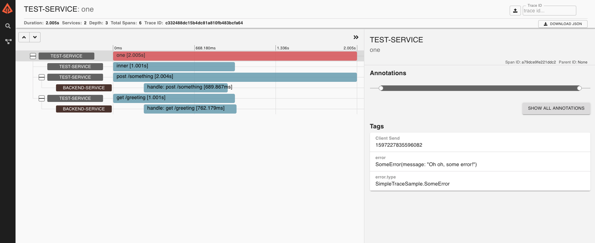

# Swift (Server) Tracing

[](https://swift.org/download/)
[](https://swift.org/download/)
[](https://swift.org/download/)
[](https://github.com/slashmo/gsoc-swift-tracing/actions?query=workflow%3ACI)

This is a collection of Swift libraries enabling the instrumentation of your server side applications using tools such
as tracers. Our goal is to provide a common foundation that allows you too freely choose how to instrument your system
with minimal changes to your actual code.

While Swift Tracing allows building all kinds of _instruments_ which can co-exist in applications transparently,
it's primary use is instrumenting multi-threaded and distributed systems with Distributed Traces.

> The tracing API is compatible with the [Open Telemetry specification](https://github.com/open-telemetry/opentelemetry-specification/blob/master/specification/trace/api.md).

---

## Instrumentation

When instrumenting server applications there are typically three parties involved:

1. [Application developers](#application-developers-setting-up-instruments) creating server-side applications
2. [Library/Framework developers](#libraryframework-developers-instrumenting-your-software) providing building blocks to create these applications
3. [Instrument developers](#instrument-developers-creating-an-instrument) providing tools to collect distributed metadata about your application

For applications to be instrumented correctly these three parts have to play along nicely.

### Use-case Example

Let's say you build an API for a fruit store that has two services, one for ordering goods and one that checks what
items are available in storage. Your frontend might make an HTTP request to the order service which then makes a
subsequent request to the storage service, just to find out that your application isn't behaving not as it should. Now
you could debug each service individually to figure out where the bug is located. If you'd instead had instrumentation
in place you could take a look take at the bigger picture instead.

One specific type of instrument that might be helpful in this case is called *Tracer*. It collects pieces of metadata
about your system (spans) and then links them to present the entire call from start to finish (trace). This metadata
contains, depending on the piece being instrumented, e.g. the request URL or an SQL query. The following image shows
one such trace presented in [Zipkin](https://zipkin.io):



**TODO**: Replace with fruit store example screenshot

In the fruit store example, we'd want a span for both the incoming HTTP request to the order service, its outgoing
request to the storage service, one for handling that request, and a span respresenting the querying of a database.
Spans naturally form a parent-child relationship, and by visually analyzing a trace we can easily spot bottlenecks for
performance profiling use-cases, and for failure debugging situations we can benefit from the application specific
metadata that spans can carry (such as noticing that failures only occur e.g. when the username contains some illegal
character or some other otherwise hard to notice situation).

### Context propagation

For instrumentation and tracing to work, certain pieces of metadata (usually in the form of identifiers), must be
carried throughout the entire system–including across process and service boundaries. Because of that, it's essential
for a context object to be passed around your application and the libraries/frameworks you depend on, but also carried
over asynchronous boundaries like an HTTP call to another service of your app.

In Swift this is done by passing a **`BaggageContext`** explicitly through APIs which participate in
instrumentation/tracing. It's vendored in its own library,
[Baggage](https://github.com/slashmo/gsoc-swift-baggage-context).

> We intentionally didn't call this something like TraceContext as we aim on supporting any kind of instrument,
not only tracers.

For each party involved we offer different libraries that all make use of `BaggageContext`.

---

## Adoption

The following libraries already support swift tracing or baggage context in their APIs:

| Library | Integrates | Status |
| --- | --- | --- |
| Swift NIO | `Baggage` | [PoC #1574](https://github.com/apple/swift-nio/pull/1574) |
| AsyncHTTPClient | `Tracing` | [PoC #289](https://github.com/swift-server/async-http-client/pull/289) |
| Swift gRPC | `Tracing` | [PoC #941](https://github.com/grpc/grpc-swift/pull/941) |

If you know of any other library please send in a PR to add it to the list, thank you!

---

## Application Developers: Setting up instruments

As an end-user building server applications you get to choose what instruments to use to instrument your system. Here's
all the steps you need to take to get up and running:

Add a package dependency for this repository in your `Package.swift` file, and one for the specific instrument you want
to use, in this case `FancyInstrument`:

```swift
.package(url: "https://github.com/slashmo/gsoc-swift-tracing.git", .branch("main")),
.package(url: "<https://repo-of-fancy-instrument.git>", from: "<4.2.0>"),
```

To your main target, add a dependency on the `Instrumentation library` and the instrument you want to use:

```swift
.target(name: "MyApplication", dependencies: ["Instrumentation", "FancyInstrument"]),
```

Then, [bootstrap the instrumentation system](#Bootstrapping-the-Instrumentation-System) to use `FancyInstrument`.

### Passing BaggageContext

`BaggageContext` should always be passed around explicitly, so it's very likely for the libraries you use to expect
a `BaggageContext`. Make sure to always pass along the context that's previously handed to you. E.g., when making an
HTTP request using `AsyncHTTPClient` in a `NIO` handler, you can use the `ChannelHandlerContext`s `baggage` property to
access the `BaggageContext`.

[Check out the `BaggageContext` repository](https://github.com/slashmo/gsoc-swift-baggage-context) for detailed
documentation about context passing.

> Note that instrumentation of `AsyncHTTPClient` and the `baggage` property of `ChannelHandlerContext` are still WIP.

## Library/Framework developers: Instrumenting your software

### Extracting & injecting BaggageContext

When hitting boundaries like an outgoing HTTP request you call out to the [configured instrument(s)](#Bootstrapping-the-Instrumentation-System):

An HTTP client e.g. should inject the given `BaggageContext` into the HTTP headers of its outbound request:

```swift
func get(url: String, context: BaggageContextCarrier) {
  var request = HTTPRequest(url: url)
  InstrumentationSystem.instrument.inject(
    context.baggage,
    into: &request.headers,
    using: HTTPHeadersInjector()
  )
}
```

On the receiving side, an HTTP server should use the following `Instrument` API to extract the HTTP headers of the given
`HTTPRequest` into:

```swift
func handler(request: HTTPRequest, context: BaggageContextCarrier) {
  InstrumentationSystem.instrument.extract(
    request.headers,
    into: &context.baggage,
    using: HTTPHeadersExtractor()
  )
  // ...
}
```

> In case your library makes use of the `NIOHTTP1.HTTPHeaders` type we already have an `HTTPHeadersInjector` &
`HTTPHeadersExtractor` available as part of the `NIOInstrumentation` library.

For your library/framework to be able to carry `BaggageContext` across asynchronous boundaries, it's crucial that you
carry the context throughout your entire call chain in order to avoid dropping metadata.

> For more information on `BaggageContext` & `BaggageContextCarrier` check out the
[Baggage library's documentation](https://github.com/slashmo/gsoc-swift-baggage-context).

### Tracing your library

When your library/framework can benefit from tracing, you should make use of it by addentionally integrating the
`Tracing` library. In order to work with the tracer
[configured by the end-user](#Bootstrapping-the-Instrumentation-System), it adds a property to `InstrumentationSystem`
that gives you back a `Tracer`. You can then use that tracer to start `Span`s. In an HTTP client you e.g.
should start a `Span` when sending the outgoing HTTP request:

```swift
func get(url: String, context: BaggageContextCarrier) {
  var request = HTTPRequest(url: url)

  // inject the request headers into the baggage context as explained above

  // start a span for the outgoing request
  let tracer = InstrumentationSystem.tracer
  var span = tracer.startSpan(named: "HTTP GET", context: context, ofKind: .client)

  // set attributes on the span
  span.attributes.http.method = "GET"
  // ...

  self.execute(request).always { _ in
    // set some more attributes & potentially record an error

    // end the span
    span.end()
  }
}
```

> ⚠️ Make sure to ALWAYS end spans. Ensure that all paths taken by the code will result in ending the span.
> Make sure that error cases also set the error attribute and end the span.

> In the above example we used the semantic `http.method` attribute that gets exposed via the
`OpenTelemetryInstrumentationSupport` library.

## Instrument developers: Creating an instrument

Creating an instrument means adopting the `Instrument` protocol (or `Tracer` in case you develop a tracer).
`Instrument` is part of the `Instrumentation` library & `Tracing` contains the `Tracer` protocol.

`Instrument` has two requirements:

1. A method to inject values inside a `BaggageContext` into a generic carrier (e.g. HTTP headers)
2. A method to extract values from a generic carrier (e.g. HTTP headers) and store them in a `BaggageContext`

The two methods will be called by instrumented libraries/frameworks at asynchronous boundaries, giving you a chance to
act on the provided information or to add additional information to be carried across these boundaries.

> Check out the [`Baggage` documentation](https://github.com/slashmo/gsoc-swift-baggage-context) for more information on
how to retrieve values from the `BaggageContext` and how to set values on it.

### Creating a `Tracer`

When creating a tracer you need to create two types:

1. Your tracer conforming to `Tracer`
2. A span class conforming to `Span`

> The `Span` conforms to the standard rules defined in [OpenTelemetry](https://github.com/open-telemetry/opentelemetry-specification/blob/master/specification/trace/api.md#span), so if unsure about usage patterns, you can refer to this specification and examples referring to it.

---

## Bootstrapping the Instrumentation System

Instead of providing each instrumented library with a specific instrument explicitly, you *bootstrap* the
`InstrumentationSystem` which acts as a singleton that libraries/frameworks access when calling out to the configured
`Instrument`:

```swift
InstrumentationSystem.bootstrap(FancyInstrument())
```

### Bootstrapping multiple instruments using MultiplexInstrument

It is important to note that `InstrumentationSystem.bootstrap(_: Instrument)` must only be called once. In case you
want to bootstrap the system to use multiple instruments, you group them in a `MultiplexInstrument` first, which you
then pass along to the `bootstrap` method like this:

```swift
InstrumentationSystem.bootstrap(MultiplexInstrument([FancyInstrument(), OtherFancyInstrument()]))
```

`MultiplexInstrument` will then call out to each instrument it has been initialized with.

## Discussions

Discussions about this topic are **more than welcome**. During this project we'll use a mixture of
[GitHub issues](https://github.com/slashmo/gsoc-swift-tracing/issues)
and [Swift forum posts](https://forums.swift.org/c/server/serverdev/14).

## Contributing

Please make sure to run the `./scripts/sanity.sh` script when contributing, it checks formatting and similar things.

You can make ensure it always is run and passes before you push by installing a pre-push hook with git:

```
echo './scripts/sanity.sh' > .git/hooks/pre-push
```
